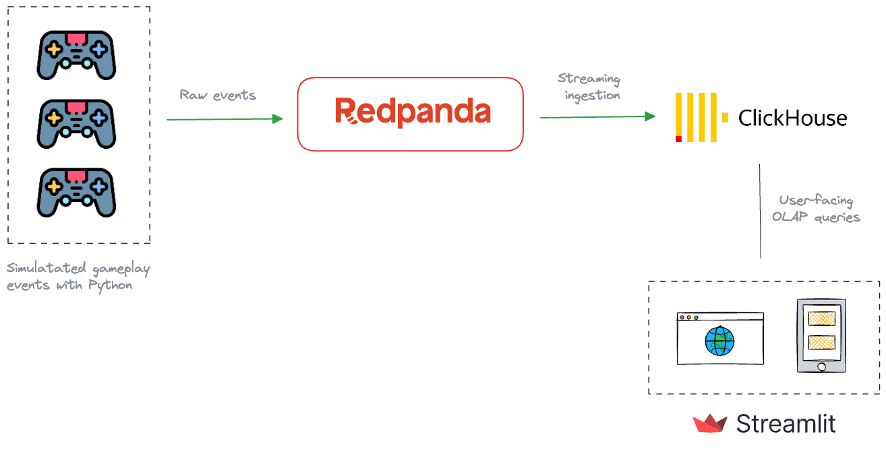
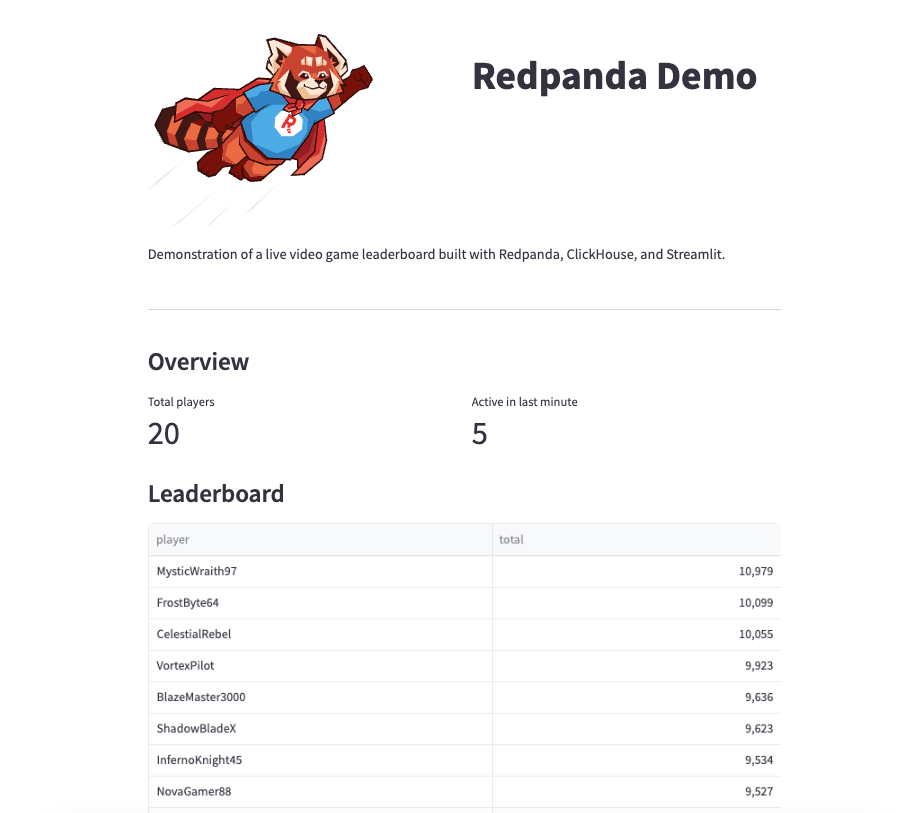

# Live video game leaderboard solution

A live video game leaderboard solution built with Redpanda, ClickHouse, and Streamlit.

## Architecture


The solution features:
- A Python script (`producer.py`) for gameplay simulation
- A Redpanda broker for real-time gameplay event ingestion
- ClickHouse for serving real-time OLAP queries
- A Streamlit dashboard for rendering the final leaderboard

You can find the completed solution inside the `completed` directory.

## Running the completed solution

In a terminal, navigate to the `completed` directory.

Start the stack by running:

```bash
docker compose up -d
```

That will spin up a Redpanda cluster with a single broker, the Redpanda Console, and a ClickHouse cluster with one server.

## Set up Redpanda

Create a Redpanda topic(`gameplays`) to hold the gameplay events:

```bash
docker compose exec redpanda rpk topic create gameplays
```

Start the Python producer that simulates gameplay events for 20 players.

```bash
python producer.py
```

You should see the `gameplays` event getting populated with JSON events.

## Set up ClickHouse
ClickHouse can be configured to ingest gameplay events from Redpanda into a table with Kafka engine.

Access the ClickHouse Playground web UI by visiting http://localhost:18123/play.

Run the following quries, one at a time to define the source table and the materialized view required.

```sql
CREATE DATABASE foo;

CREATE TABLE IF NOT EXISTS foo.scores_raw
(
    event_id String,
    game_id UInt64,
    player String,
    created_at DateTime,
    score UInt32
) ENGINE = Kafka()
SETTINGS
    kafka_broker_list = 'redpanda:9092',
    kafka_topic_list = 'gameplays',
    kafka_group_name = 'clickhouse-group',
    kafka_format = 'JSON'


CREATE MATERIALIZED VIEW foo.scores_view
ENGINE = Memory
AS
SELECT * FROM foo.scores_raw
SETTINGS
stream_like_engine_allow_direct_select = 1;
```

To verify the whether the materialized view is getting populated, run the following query in the playground.

```sql
SELECT * FROM foo.scores_view;
```

It should print all the results received from Redpanda so far.

## Run the Streamlit dashboard

Navigate to the `streamlit` directory and run the dashboard by:

```
streamlit run app.py
```

You should see something like this when you visit http://localhost:8501/



## Contributions/questions?

Follow/DM me on [Twitter](https://twitter.com/dunithd)